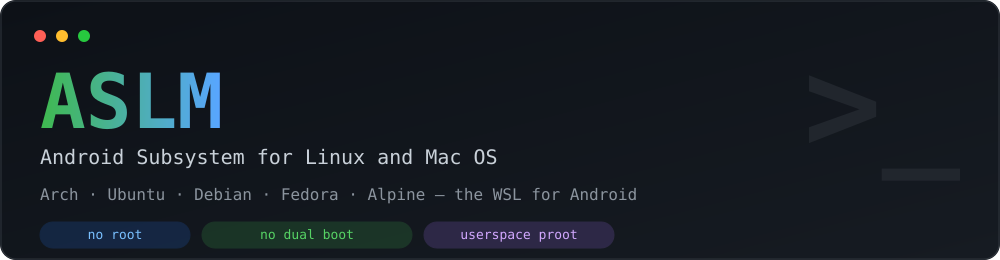
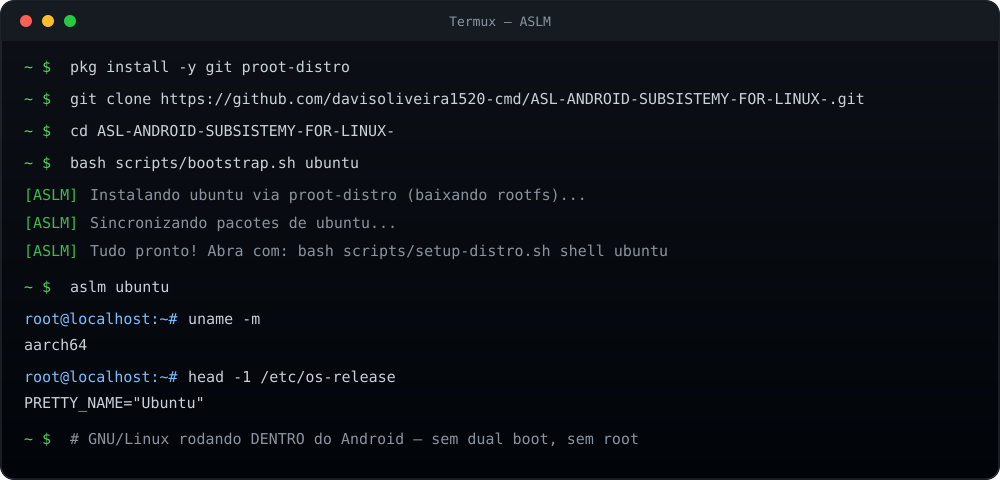

<div align="center">



# ASLM — Android Subsystem for Linux and Mac OS

**Run GNU/Linux and (experimental) macOS on top of Android, with no dual boot.**

🇧🇷 [Português](README.md) · 🇺🇸 **English**

Runs **Arch Linux, Ubuntu, Debian, Fedora, Alpine** and other **GNU/Linux** distributions in user space on top of Android using [Termux](https://github.com/termux/termux-app) + [`proot-distro`](https://github.com/termux/proot-distro).
Includes a gaming profile inspired by [Bazzite](https://github.com/ublue-os/bazzite) for **Steam**, plus an **experimental x86_64** runner for macOS via [docker-osx](https://github.com/sickcodes/docker-osx).

</div>

---

> [!IMPORTANT]
> **This is NOT dual boot.** ASLM does **not touch the boot partition** and does **not replace Android**. It just **installs GNU/Linux distributions on top of Android**, inside Termux, alongside your normal apps. Nothing is written outside Termux folders — to remove it, just delete the distro or the app.

---

## ⚠️ Honest disclaimer (read first)

- **Android is already Linux.** The Android kernel is a fork of Linux. ASLM does not replace the kernel — it adds GNU/Linux distributions on top of Android (the WSL idea, but reversed: Linux user space on Android, not on Windows).
- **macOS on Android is EXPERIMENTAL and x86_64 + KVM only.** [docker-osx](https://github.com/sickcodes/docker-osx) needs hardware virtualization (KVM) and the x86_64 architecture. Most phones are ARM64, so **macOS does not work on that majority** — only on x86_64 Android tablets/PCs or emulators with KVM. `setup-macos.sh` detects and warns if your device is unsupported.
- **Steam on ARM64 is slow/experimental.** Native games will not run well. ASLM sets up the environment (box64 + X11 + Vulkan-Lavapipe) so you can try lighter titles.

---

## ✨ What ASLM does

| Layer | What it is | Status |
|---|---|---|
| 🐧 **Android Subsystem for Linux** | Arch, Ubuntu, Debian, Fedora, Alpine and more via `proot-distro`, no root | ✅ Stable |
| 🎮 **Steam + Bazzite-like** | Gaming environment (Steam, Lutris, GameMode, MangoHud) inside the proot Linux | 🧪 Experimental (ARM64) / ✅ x86_64 |
| 🍎 **macOS runner** | macOS instance via Docker/KVM (docker-osx) | ⚠️ x86_64 + KVM only |

No dual boot: **everything runs inside Android**, on the same device, alongside your apps.

### 🐧 Supported distros

| ASLM name | Base | Package manager |
|---|---|---|
| `archlinux` (default) | Arch Linux | `pacman` |
| `manjaro` | Manjaro | `pacman` |
| `ubuntu` | Ubuntu | `apt` |
| `debian` | Debian | `apt` |
| `fedora` | Fedora | `dnf` |
| `rocky` / `alma` | RHEL-compatible | `dnf` |
| `opensuse` | openSUSE Tumbleweed | `zypper` |
| `alpine` | Alpine Linux | `apk` |
| `void` | Void Linux | `xbps` |
| `bazzite` | Fedora + gaming stack | `dnf` + RPM Fusion |

> **`bazzite`** is a **gaming profile** (Fedora + Steam/Lutris/GameMode/MangoHud), not the immutable Bazzite system. Real Bazzite is an OCI/Fedora Atomic image and does not run via `proot-distro`.

---

## 🖥️ Demo

Installing Ubuntu on top of Android via Termux — notice it is just Termux running, **no dual boot at all**:



---

## 🚫 No dual boot (how it works)

- ASLM runs **100% inside Android**, as an app (Termux).
- It does **not** touch the bootloader, create a partition, or reboot the device.
- Android stays intact and your apps keep working as usual.
- Linux and Android run **at the same time** — you switch by switching apps.
- To uninstall: `bash scripts/setup-distro.sh remove <distro>` or remove Termux.

---

## 📦 Requirements

- Android **8.0 (Oreo)+** (10+ recommended)
- [Termux](https://f-droid.org/packages/com.termux/) (install from F-Droid, not the Play Store — the Play Store version is outdated)
- ~4–8 GB of free storage (base Arch ~1 GB; Steam + games much more)
- For **macOS**: an **x86_64** device with `/dev/kvm` (ARM64 phones do **not** support it)

---

## 🚀 Download and install ASLM (via Termux)

ASLM is **downloaded and run inside [Termux](https://f-droid.org/packages/com.termux/)** — the Linux terminal that runs on Android itself. Everything happens on the phone: **no root and no dual boot**.

### 1. Install Termux

Get Termux from **F-Droid** (do not use the Play Store version, it is outdated):

👉 https://f-droid.org/packages/com.termux/

### 2. Download ASLM inside Termux

Open Termux and run:

```sh
pkg update && pkg upgrade -y
pkg install -y git proot-distro
git clone https://github.com/davisoliveira1520-cmd/ASL-ANDROID-SUBSISTEMY-FOR-LINUX-.git
cd ASL-ANDROID-SUBSISTEMY-FOR-LINUX-
```

### 3. Run the installer

```sh
bash scripts/bootstrap.sh            # Arch Linux (default)
bash scripts/bootstrap.sh ubuntu     # or pick another distro
bash scripts/bootstrap.sh bazzite    # gaming profile (Fedora + games)
```

> **Prefer a single command (no clone)?** Download and run directly in Termux:
> ```sh
> curl -fsSL https://raw.githubusercontent.com/davisoliveira1520-cmd/ASL-ANDROID-SUBSISTEMY-FOR-LINUX-/main/scripts/bootstrap.sh | bash -s -- ubuntu
> ```
> (replace `ubuntu` with `archlinux`, `debian`, `fedora`, `bazzite`, etc.)

---

## 📚 Usage

```sh
# Manage distros
bash scripts/setup-distro.sh list            # list supported distros
bash scripts/setup-distro.sh install ubuntu  # install Ubuntu
bash scripts/setup-distro.sh install bazzite # gaming profile (Fedora + games)
bash scripts/setup-distro.sh shell ubuntu    # open the shell

# Single shortcut (created by bootstrap) — uses the default distro
aslm                       # enter the default distro (Arch)
aslm ubuntu                # enter Ubuntu
aslm -- neofetch           # run a command inside the distro

# Bazzite-style gaming layer
bash scripts/setup-steam.sh setup archlinux
bash scripts/setup-steam.sh start archlinux

# macOS runner (x86_64 + KVM only)
bash scripts/setup-macos.sh run
```

More details:

- [`docs/arquitetura.md`](docs/arquitetura.md) — how ASLM works under the hood
- [`docs/compatibilidade.md`](docs/compatibilidade.md) — what runs and what does not
- [`scripts/`](scripts/) — install and configuration scripts

---

## 🧱 Credits & sources

This project is an orchestration/documentation layer over third-party code:

- 🐧 **Arch Linux kernel**: [`archlinux/linux`](https://github.com/archlinux/linux)
- 📦 **proot-distro**: [`termux/proot-distro`](https://github.com/termux/proot-distro)
- 🍎 **macOS ISO / docker-osx**: [`sickcodes/docker-osx`](https://github.com/sickcodes/docker-osx)
- 🎮 **Steam / gaming-style**: [`ublue-os/bazzite`](https://github.com/ublue-os/bazzite)
- 🐆 **x86 on ARM emulation**: [`ptitSeb/box64`](https://github.com/ptitSeb/box64) and [`ptitSeb/box86`](https://github.com/ptitSeb/box86)

> **Important:** respect each upstream project's license. macOS is proprietary Apple software — installing it on non-Apple hardware violates the EULA and is your responsibility.

---

## 📄 License

MIT — see [LICENSE](LICENSE).

Each upstream component keeps its own license.
